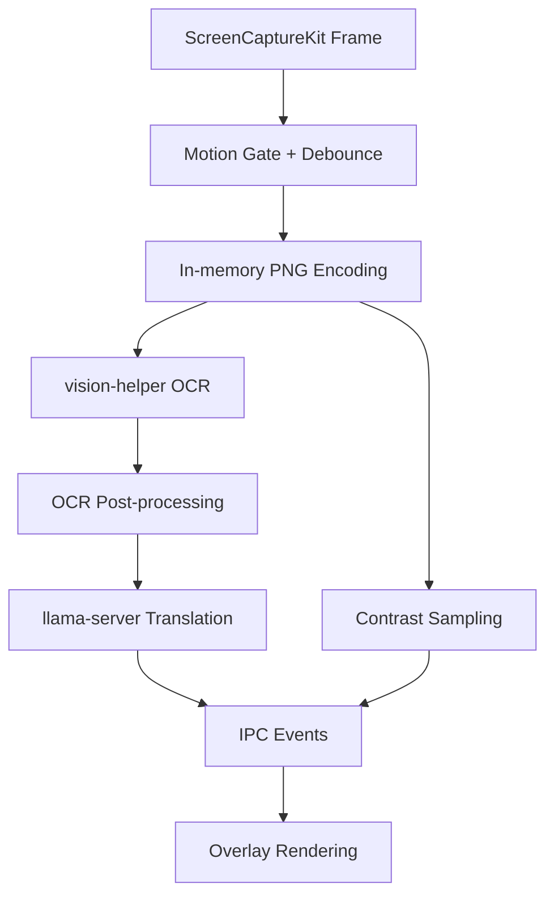

# Contextura

Contextura is an offline, real-time Japanese-to-English screen translation overlay for macOS.
It helps English-speaking users understand Japanese UI, subtitles, and game text without sending captured content to cloud services.

Status: active local development, no public hosted demo yet.

## Table of Contents

- [Contextura](#contextura)
  - [Table of Contents](#table-of-contents)
  - [Who It Is For](#who-it-is-for)
  - [Problem](#problem)
  - [What Was Built](#what-was-built)
  - [Demo](#demo)
  - [Quickstart](#quickstart)
  - [Prerequisites](#prerequisites)
  - [Configuration and Models](#configuration-and-models)
    - [Default model](#default-model)
    - [Model compatibility](#model-compatibility)
    - [Environment variables](#environment-variables)
  - [How to Run](#how-to-run)
    - [App mode](#app-mode)
    - [Headless single-image OCR + translation](#headless-single-image-ocr--translation)
    - [Headless corpus run](#headless-corpus-run)
  - [Testing and Verification](#testing-and-verification)
  - [Evaluation Evidence](#evaluation-evidence)
  - [Monitoring and Observability](#monitoring-and-observability)
  - [Architecture](#architecture)
  - [Project Structure](#project-structure)
  - [Decisions and Trade-offs](#decisions-and-trade-offs)
  - [Deployment and CI/CD](#deployment-and-cicd)
  - [Limitations](#limitations)
  - [Future Work](#future-work)
  - [Troubleshooting](#troubleshooting)
  - [Related Docs](#related-docs)
  - [License](#license)

## Who It Is For

- Users who read Japanese content on macOS and want instant English overlays.
- Developers who want a local-first OCR + LLM overlay pipeline.
- People who prioritize privacy and prefer no cloud dependency for core translation.

## Problem

Reading Japanese text on dynamic screens is hard when:

- text changes quickly while scrolling,
- OCR quality varies by script mix and font style,
- translation latency breaks the flow,
- cloud APIs are not acceptable for privacy reasons.

Most alternatives either require cloud APIs, feel slow on interactive screens, or do not preserve spatial context well enough for overlays.

## What Was Built

Contextura combines native capture, OCR, local inference, and overlay rendering:

- ScreenCaptureKit capture with explicit BGRA frames.
- Motion gate + debounce to avoid OCR during active movement.
- Swift Vision helper (`vision-helper`) for OCR.
- Local `llama-server` sidecar for translation.
- Contrast-aware styled overlay boxes in a transparent Tauri window.
- Runtime controls for force-scan, overlay toggle, memory reset, and model cycling.

Hotkeys:

- `Cmd+Shift+T`: toggle overlay
- `Cmd+Shift+R`: force immediate OCR/translation pass
- `Cmd+Shift+M`: clear translation memory and overlay state
- `Cmd+Shift+G`: switch to next installed model and reload runtime
- `Cmd+Shift+Q`: quit

## Demo

There is no public deployment today.

Fastest local demo path:

1. Start the app with `cargo tauri dev`.
2. Open Japanese text on screen.
3. Press `Cmd+Shift+R` to force a translation cycle.
4. Verify translated boxes appear over source text.

For non-GUI proof, run the headless debug CLI against `test-corpus` (see [Testing and Verification](#testing-and-verification)).

## Quickstart

From a clean clone:

```bash
git clone https://github.com/nazakun021/contextura.git
cd contextura
python3 -m pip install huggingface_hub
huggingface-cli download mradermacher/translategemma-4b-it-GGUF \
  translategemma-4b-it.Q4_K_M.gguf \
  --local-dir ~/Library/Application\ Support/contextura/models/
cargo tauri dev
```

Then grant Screen Recording permission when prompted by macOS.

## Prerequisites

- macOS 13+
- Apple Silicon (M1/M2/M3/M4)
- Xcode + Command Line Tools
- Rust toolchain
- Python 3 (for model download helper)

Verify:

```bash
xcodebuild -version
xcode-select -p
rustc --version
cargo --version
python3 --version
```

## Configuration and Models

### Default model

Current default model ID:

- `translategemma-4b-it.Q4_K_M`

Expected file location:

- `~/Library/Application Support/contextura/models/translategemma-4b-it.Q4_K_M.gguf`

### Model compatibility

Supported runtime architecture:

- decoder-only GGUF models (TranslateGemma default, Qwen-style alternatives)

Not supported by this pipeline:

- encoder-decoder models such as NLLB, MarianMT, T5, BART

### Environment variables

Optional telemetry/crash reporting:

- `CONTEXTURA_SENTRY_DSN` (unset by default)

If unset, Sentry remains disabled.

## How to Run

### App mode

```bash
cargo tauri dev
```

### Headless single-image OCR + translation

```bash
cargo run --manifest-path src-tauri/Cargo.toml -- \
  --debug-cli \
  --input /absolute/path/to/sample.png \
  --pretty
```

### Headless corpus run

```bash
cargo run --manifest-path src-tauri/Cargo.toml -- \
  --debug-cli \
  --test-suite test-corpus
```

## Testing and Verification

Recommended verification sequence:

1. Rust gates
2. Wire-to-wire CLI probe
3. Full corpus run
4. Manual GUI smoke pass

Commands:

```bash
cargo check --manifest-path src-tauri/Cargo.toml
cargo test --manifest-path src-tauri/Cargo.toml
cargo clippy --manifest-path src-tauri/Cargo.toml --all-targets --all-features -- -D warnings
./scripts/smoke-wire-to-wire.sh
```

Quick smoke mode (skips clippy):

```bash
./scripts/smoke-wire-to-wire.sh --quick
```

Install local pre-push hooks:

```bash
./scripts/install-git-hooks.sh
```

This enforces formatting/lint checks before `git push`.

## Evaluation Evidence

Contextura currently provides strong functional regression evidence through golden fixtures, but does not yet publish benchmark-style quality metrics like BLEU/COMET.

What is covered today:

- End-to-end OCR + translation assertions through `test-corpus/` expected JSON fixtures.
- Coordinate-aware OCR checks (`ocr_boxes`) in corpus expectations.
- CLI corpus runner for repeatable local verification.

What is not yet covered:

- formal translation quality benchmark suite with aggregate accuracy metrics,
- latency distribution report across hardware tiers,
- human-rated quality rubric dataset.

## Monitoring and Observability

Available now:

- Structured runtime logs for pipeline stages.
- `[Latency]` logs for OCR, concurrent stage, and completion timing.
- Sidecar health checks with watchdog restart behavior.
- Optional Sentry integration gated by `CONTEXTURA_SENTRY_DSN`.

Not available yet:

- centralized dashboard (e.g., Grafana),
- persistent production telemetry backend,
- aggregated long-term metric storage.

## Architecture



Key runtime events sent to the overlay:

- `translation-started`
- `translation-update`
- `translation-clear`
- `translation-error`

## Project Structure

```text
contextura/
├── src/                            # overlay HTML/CSS/JS + wizard UI
├── src-tauri/                      # Rust app + sidecar orchestration
│   ├── binaries/                   # bundled llama-server and vision-helper
│   └── src/
│       ├── lib.rs                  # app bootstrap and runtime orchestration
│       ├── capture.rs              # ScreenCaptureKit capture
│       ├── motion.rs               # motion ratio + debounce state machine
│       ├── ocr.rs                  # OCR facade
│       ├── ocr_backend.rs          # OCR subprocess transport
│       ├── ocr_post_processor.rs   # filtering/order/dedup
│       ├── translation.rs          # translation strategies + watchdog
│       ├── sidecar_runtime_adapter.rs
│       ├── runtime_executor.rs
│       ├── styling.rs              # WCAG-aware styling
│       ├── cli.rs                  # debug-cli and test-suite runner
│       └── models.rs               # model manifest and selection
├── test-corpus/                    # PNG fixtures + expected JSON
├── scripts/                        # smoke and hook helper scripts
└── docs/                           # SPEC, ROADMAP, TEST, setup, ADRs
```

## Decisions and Trade-offs

1. Local-first inference over cloud APIs

- Chosen for privacy and offline reliability.
- Trade-off: larger local footprint and model management complexity.

2. Motion-gated OCR pipeline

- Chosen to reduce redundant OCR calls during scrolling.
- Trade-off: added state-machine complexity and tuning sensitivity.

3. Native OCR helper process (Swift Vision)

- Chosen for macOS-native OCR quality and performance.
- Trade-off: cross-language process boundary and lifecycle management.

4. Decoder-only GGUF via `llama-server`

- Chosen for local runtime compatibility and predictable serving.
- Trade-off: excludes encoder-decoder translation models.

## Deployment and CI/CD

Deployment:

- No public hosted deployment at this time.
- Primary run mode is local desktop app execution.

CI/CD:

- No fully documented remote CI pipeline in this repository yet.
- Local quality gates are enforced via `scripts/install-git-hooks.sh` and smoke scripts.

Release hardening notes:

- Updater endpoints are configured, but `plugins.updater.pubkey` is currently empty in `src-tauri/tauri.conf.json`.
- `app.security.csp` is currently `null` and should be hardened before production release.

## Limitations

- macOS-only (13+) and Apple Silicon-focused.
- No public web demo or hosted installer flow documented in this repo.
- No formal benchmark dashboard for translation quality yet.
- Real-world quality depends on local model quality and machine resources.
- Manual GUI smoke verification is still required for true end-to-end confidence.

## Future Work

- Add repeatable translation-quality benchmark datasets and aggregate metrics.
- Document and automate a remote CI pipeline for pull requests.
- Complete downloader UX wiring for fully in-app model onboarding.
- Harden CSP and configure updater signing key for production.
- Expand corpus coverage for edge-case script mixes and UI-heavy layouts.

## Troubleshooting

1. No overlays appear

- Check Screen Recording permission in macOS Privacy settings.
- Press `Cmd+Shift+R` to force a scan.
- Verify logs for OCR or sidecar errors.

2. Sidecar not healthy

- Confirm model file exists at expected path.
- Probe sidecar health:

```bash
curl http://127.0.0.1:8765/health
```

3. Debug CLI fails

- Ensure `--debug-cli` is paired with `--input <PNG>` or `--test-suite <DIR>`.

4. Lint/test failures before push

- Run:

```bash
cargo fmt --all
cargo clippy --manifest-path src-tauri/Cargo.toml --all-targets --all-features -- -D warnings
cargo test --manifest-path src-tauri/Cargo.toml
```

## Related Docs

- `docs/SPEC.md`
- `docs/SETUP.md`
- `docs/TEST.md`
- `docs/TECH-STACK.md`
- `docs/MISSION.md`
- `docs/ROADMAP.md`
- `docs/adr/`

## License

This project is licensed under the MIT License. See `LICENSE` for details.
