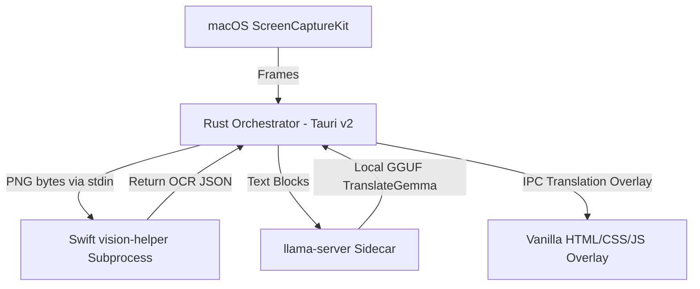

# Tech Stack & Architecture

Contextura uses a hybrid architecture combining Rust for orchestration and systems integration, Swift for native macOS API access, llama.cpp for local AI inference, and HTML/CSS/JS for lightweight, zero-dependency overlays.

## Component Overview

## End-to-End Data Flow

1. **Stream Capture**: `capture.rs` starts an `SCStream` for the display. Frames are copied out of the pixel buffer as BGRA bytes.
2. **Motion Detection**: `motion.rs` downsamples frames to `160x90` grayscale and computes the motion ratio.
3. **Debounce Gate**: `DebounceStateMachine` decides whether to clear overlays, wait, or trigger a scan based on screen settling (200ms default).
4. **Snapshot Encoding**: On trigger or manual force-scan, the orchestrator (`lib.rs`) converts BGRA to RGBA once. `ocr.rs` encodes that frame to PNG bytes in memory.
5. **OCR Subprocess**: `ocr.rs` invokes `vision-helper --stdin`, streams PNG bytes through stdin, handles timeouts, and converts Vision relative coordinates to overlay coordinates.
6. **Sidecar Translation**: `translation.rs` formats request payloads depending on active model: sequential completions for `TranslateGemma` or numbered batched completions for Qwen.
7. **Styling**: `styling.rs` samples background colors from the RGBA buffer and determines WCAG-compliant high-contrast foreground colors.
8. **IPC Update**: `ipc.rs` structures payloads and emits Tauri events (`translation-started`, `translation-update`, `translation-clear`, `translation-error`) to the overlay window.
9. **Rendering**: `src/overlay.js` receives the IPC events and renders the styled translation boxes in the transparent HTML overlay DOM.

---

## Key Runtime Decisions

- **Capture Format**: Pixel format is explicitly `BGRA`.
- **Snapshot Encoding**: Converts BGRA to RGBA once and reuses that RGBA buffer for styling.
- **Scale Factor**: Derived dynamically from ScreenCaptureKit display metadata, not hardcoded.
- **Model-Specific Prompting**: Qwen-style numbered batches with `/no_think`, or TranslateGemma structured chat requests without `/no_think`.
- **Cached Frame Path**: Force scan reuses the latest cached capture frame instead of waiting for another stream tick.
- **Watchdog Protection**: Restarts `llama-server` after repeated failed health checks.
- **Context Invalidation**: Memory is cleared on app switch and manual reset.
- **Overlay Capture Exclusion**: Prefers direct window exclusion for Contextura-owned windows, and the overlay window is also marked `NSWindowSharingType::None`.
- **Deduplication Strategy**: OCR post-processing sorts detections into stable reading order and only deduplicates near-identical boxes, preserving distinct overlapping text.
- **Debounce Resilience**: Settling requires larger motion than the active scrolling threshold before debounce is cancelled, reducing inertial-scroll resets.
- **File-I/O Avoidance in OCR Hot Path**: Runtime OCR no longer depends on per-frame temp-frame file writes; PNG payloads are streamed to the helper.
- **In-Memory OCR Handoff**: OCR no longer depends on per-frame cache-file roundtrips in the runtime hot path; PNG payloads are piped directly to the helper.
- **Content Security Policy**: CSP hardening is planned; current Tauri config sets `app.security.csp` to null and should be tightened before production release.

---

## Module Responsibilities

| File                           | Responsibility                                                           | Status                                                                |
| :----------------------------- | :----------------------------------------------------------------------- | :-------------------------------------------------------------------- |
| `src-tauri/src/lib.rs`         | Tauri setup, main runtime loop, and coordination                         | Active                                                                |
| `src-tauri/src/capture.rs`     | ScreenCaptureKit capture and frame extraction                            | Active                                                                |
| `src-tauri/src/motion.rs`      | Motion detection and debounce calculations                               | Active                                                                |
| `src-tauri/src/ocr.rs`         | OCR subprocess (`vision-helper`) integration, coordinates, and filtering | Active                                                                |
| `src-tauri/src/translation.rs` | Sidecar lifecycle, health checks, batching, and LLM completions          | Active                                                                |
| `src-tauri/src/styling.rs`     | WCAG contrast-aware overlay styling                                      | Active                                                                |
| `src-tauri/src/context.rs`     | App-switch invalidation of context memory                                | Active                                                                |
| `src-tauri/src/thermal.rs`     | Thermal state and battery throttling signals                             | Active                                                                |
| `src-tauri/src/hotkeys.rs`     | Global shortcut listeners                                                | Active                                                                |
| `src-tauri/src/tray.rs`        | Tray menus and primary action bindings                                   | Active                                                                |
| `src-tauri/src/ipc.rs`         | Event payload types sent to the overlay                                  | Active                                                                |
| `src-tauri/src/downloader.rs`  | Model download helper                                                    | Implemented helper; full in-app workflow integration is still pending |
| `src-tauri/src/cli.rs`         | CLI parsing for tests and debug mode                                     | Active                                                                |
| `src-tauri/src/snapshot.rs`    | In-memory PNG encoding and stale temp-frame cleanup utilities            | Active                                                                |

---

## Frontend Layout

The frontend remains static and framework-free:

- `src/index.html` — Transparent overlay frame
- `src/overlay.js` — IPC listener and box renderer
- `src/overlay.css` — Box layouts and animations
- `src/wizard.html` — First-run setup screens (1–4)
- `src/help.html` — Documentation and keyboard shortcuts reference

The overlay listens for:

- `translation-started`
- `translation-update`
- `translation-clear`
- `translation-error`

---

## Sidecars

### `vision-helper`

- **Source**: Swift binary in `src-tauri/src/bin/vision-helper.swift`.
- **Framework**: Uses Apple Vision OCR.
- **Pipeline**: Accepts stdin PNG bytes (`--stdin`) for runtime OCR and supports image-path input for compatibility/testing. Returns JSON OCR boxes on success.
- **Selection**: Inspects multiple Vision candidates per observation and favors Japanese/CJK text when present.

### `llama-server`

- **Lifecycle**: Managed sidecar running on `127.0.0.1:8765`.
- **Requirement**: Requires a decoder-only GGUF model.
- **Default Target**: `translategemma-4b-it.Q4_K_M.gguf` under the application support directory.
- **Recovery**: Restarted by the Rust watchdog on repeated health-check failures.
